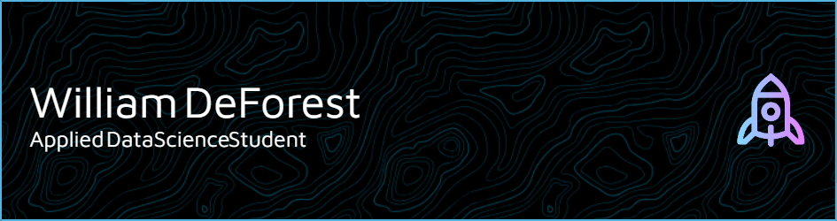

<h1 align="center">Hi 👋, everyone! I'm William DeForest 🙂</h1>
<h3 align="center">Grad student (and athlete!⚾) at the University of Chicago</h3>

### 💁‍♂️ About Me
- MS in Applied Data Science student at the University of Chicago Data Science Institute.
- I'm also a 2023 graduate from Claremont McKenna College where I majored in Economics with a sequence in Data Science.
- I call Seattle, WA home, but I'm currently living, studying and playing baseball in Chicago, IL.
- I am a catcher for the University of Chicago Maroons baseball team
- Whether it's on the field, in the classroom, or at the office, I love being a part of a team!
- I am excited by the new frontier of AI and I'm tailoring my coursework to gain experience in this area.
- I'm currently seeking data analyst, data scientist, or product management Summer 2024 internships in the Greater Seattle or Bay Areas.

### 🌱 I'm Currently Learning
- Data Engineering Platforms - SQL and NoSQL systems, relational and analytical data models, ETL functions 
- Natural Language Processing - Text processing and sentiment analysis, machine reading comprehension, generating text using prompts and steer models, creating a RAG agent
- Data Mining Principles - Cluster analysis, dimension reduction via principal component analysis, predictive modeling using regression, classification, decision trees, random forest, bagging, boosting, and ensemble models, k-nearest neighbors, support vector machines, neural networks, recommendation engines, and social network analysis.
- Leadership & Consulting for Data Science - Identifying organizational challenges, designing quantitative analyses that offer credible, practicable
solutions, articulating data science concepts and creating engaging presentations for stakeholders

### 🔭 Projects
- Data Engineering Final Project
- Leadership & Consulting Final Project
- DBacks Project Description
- Dodgers Capstone Description
- Storyhouse Ventures Description
- ML Stats Learning Final Project
- Senior Thesis
- Environmental Econ Final Project
- Leadership in Sports UD Pres. (Maybe)

<h3 align="left">Connect with me:</h3>

- 📫 **wdeforest@uchicago.edu**

- 📄 **Resume:** [https://drive.google.com/file/d/1BlmzPsPOmKQW2aLhXZ8oPA2plX-n0iU-/view?usp=sharing](https://drive.google.com/file/d/1BlmzPsPOmKQW2aLhXZ8oPA2plX-n0iU-/view?usp=sharing)

<h3 align="left">Languages and Tools:</h3>

       

