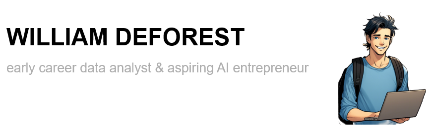

# Hey, I'm Will 👋

### 💁‍♂️ About Me...
- I'm a recent MS in Applied Data Science Grad (and student athlete ⚾) from the **University of Chicago**
- I graduated in 2023 from **Claremont McKenna College** where I majored in Econ and minored in Data Science
- Home is Seattle, WA 🥰🏡
- I love being a part of a team 🤝🙌
- I'm fascinated by AI and I love reading about, exploring, and developing new AI applications
- I'm looking for my first full-time job 😱 and I'm interested in data/product analyst, data scientist, or product management roles

### 🌱 I'm Currently Learning...
- AI Agents:
- How to Build Better Habits Healthily
- Snowboarding:

### 🔭 Projects...
- [Predicting NBA Basketball Player Salaries](https://github.com/wdeforest23/Predicting-NBA-Basketball-Player-Salaries) | Data Engineering Final Project | Dec 2023
- [E-Bookstore Recommendation Engine (RFM and KNN clustering)](https://github.com/wdeforest23/EBookstore-RFM-Book-Recommendation-System) | Leadership & Consulting Final Project | Dec 2023
- [Analyzing the Usage of Key Coronavirus Hashtags on Twitter to Track the Spread of Covid-19](https://github.com/wdeforest23/twitter_coronavirus) | Data Structures & Algorithms Final Project | May 2023
- [Predicting the Probability of Throwing Out Runners From the Outfield](https://github.com/wdeforest23/Predicting-the-Probability-of-Throwing-Out-Runners-From-the-Outfield) | CMC Data Science Capstone Project | May 2023
- [Modeling the Performance-based Compensation of MLB Catchers](https://scholarship.claremont.edu/cmc_theses/3155/) | CMC Senior Thesis in Economics | Dec 2022
- [Predicting Recidivism Using Logistic Regression and Random Forest Modeling](https://github.com/wdeforest23/Predicting-Recidivism-DS-Stats-Learning-2022) | Data Science for Stat. Learning Final Project | Dec 2021

  ### 🌱 I'm Currently Reading...

### Connect with me:
- 📫 **williamdeforest29@gmail.com**
- 🔗 **LinkedIn:** [LinkedIn](https://www.linkedin.com/in/william-deforest/))

  
  

---

### 🛠️ Languages and Tools

  
  
  
  
  

